# 🚗 Sistema de Gestión de Parqueadero

Aplicación de escritorio desarrollada en C# y Windows Forms para administrar el ingreso y salida de vehículos en un parqueadero.

El sistema permite registrar automóviles y motocicletas, asignar puestos de estacionamiento, calcular tarifas automáticamente según el tipo de vehículo y visualizar en tiempo real el estado de ocupación del parqueadero mediante una interfaz gráfica interactiva.

## 👥 Integrante

| Estefanía Zapata Suárez | Desarrolladora | Modelado de clases, lógica de negocio, interfaz gráfica, validaciones y documentación |

## 📌 Descripción del problema

Muchos parqueaderos pequeños realizan el control de ingreso y salida de vehículos de manera manual, lo que puede generar errores en el registro, dificultades para calcular los cobros y poca organización en la asignación de puestos.

Este proyecto busca ofrecer una solución sencilla mediante una aplicación de escritorio que permita administrar vehículos de forma más organizada, controlando los espacios disponibles, validando la información ingresada y automatizando el cálculo de tarifas.

## 🎯 Objetivo del sistema

Desarrollar una aplicación de escritorio en C# y Windows Forms que permita gestionar el ingreso y salida de vehículos en un parqueadero, aplicando conceptos de Programación Orientada a Objetos, validaciones y una interfaz gráfica interactiva.

### Objetivos específicos

- Registrar automóviles y motocicletas.
- Asignar puestos de estacionamiento.
- Validar formatos de placas.
- Calcular automáticamente el valor a pagar.
- Visualizar el estado de ocupación del parqueadero.
- Buscar vehículos por placa.
- Aplicar conceptos de POO y modularización.

## 🛠️ Tecnologías utilizadas

- C#
- .NET 10
- Windows Forms (WinForms)
- Visual Studio Code
- Git
- GitHub

## 📋 Requisitos previos

Antes de ejecutar el proyecto es necesario tener instalado:

- .NET SDK 10 o superior
- Visual Studio Code o Visual Studio
- Git (opcional, para clonar el repositorio)

## ⚙️ Instalación

Clonar el repositorio:

```bash
git clone https://github.com/estefaniazapata255-cyber/GestionParqueadero.git
```

Entrar a la carpeta del proyecto:

```bash
cd GestionParqueadero
```

## ▶️ Ejecución

Compilar el proyecto:

```bash
dotnet build
```

Ejecutar la aplicación:

```bash
dotnet run
```

## ✨ Funcionalidades principales

- 📥 Registro de ingreso de vehículos.
- 🚪 Registro de salida y generación de cobro.
- 🚗 Gestión de automóviles y motocicletas.
- 🅿️ Asignación de puestos mediante matriz visual.
- 🔍 Búsqueda de vehículos por placa.
- ✅ Validación automática de formatos de placas.
- 📊 Visualización en tiempo real de vehículos activos.
- 🎨 Interfaz gráfica interactiva con Windows Forms.
- ⚠️ Mensajes de validación y control de errores.
- 💰 Cálculo automático de tarifas según el tipo de vehículo.

## 🧠 Conceptos de Programación Orientada a Objetos aplicados

### 🔹 Clases y objetos

El sistema utiliza clases para representar las entidades principales del dominio, como `Vehiculo`, `Carro` y `Motocicleta`.

### 🔹 Encapsulamiento

Se aplicó encapsulamiento mediante propiedades con `get` y `protected set`, controlando el acceso y modificación de los datos internos de los vehículos.

### 🔹 Herencia

Las clases `Carro` y `Motocicleta` heredan de la clase base abstracta `Vehiculo`, reutilizando atributos y comportamientos comunes.

### 🔹 Polimorfismo

Se implementó polimorfismo mediante el método abstracto `CalcularCobro()`, el cual es sobrescrito en cada clase hija para aplicar reglas de cobro diferentes.

### 🔹 Abstracción

La clase `Vehiculo` fue definida como abstracta para representar un concepto general de vehículo y obligar a las clases hijas a implementar su propia lógica de cobro.

### 🔹 Colecciones genéricas

Se utilizó `List<Vehiculo>` para almacenar y administrar dinámicamente los vehículos activos dentro del parqueadero.

### 🔹 Matrices

Se implementó una matriz bidimensional `string[,]` para representar visualmente los puestos del parqueadero y controlar la ocupación de espacios.

## 🏗️ Estructura del proyecto

```text
GestionParqueadero/
│
├── Modelo/
│   ├── Vehiculo.cs
│   ├── Carro.cs
│   └── Motocicleta.cs
│
├── Servicios/
│   └── ParqueaderoServicio.cs
│
├── Vistas/
│   ├── VentanaPrincipal.cs
│   └── VentanaPrincipal.Eventos.cs
│
├── docs/
│   ├── capturas/
│   └── diagramas/
│
├── Program.cs
├── README.md
└── .gitignore
```

## 🏛️ Arquitectura del sistema

El proyecto se encuentra organizado por capas para mejorar la modularidad, reutilización y mantenimiento del código.

### 🔹 Modelo

Contiene las clases principales del dominio del problema, como los vehículos y sus reglas de comportamiento.

### 🔹 Servicios

Administra la lógica de negocio del sistema, incluyendo registros, búsquedas, validaciones y cálculos.

### 🔹 Vistas

Contiene la interfaz gráfica desarrollada con Windows Forms y los eventos que permiten la interacción con el usuario.

### 🔹 docs

Incluye documentación complementaria, capturas de pantalla y diagramas UML del proyecto.

## ✅ Validaciones implementadas

El sistema incluye diferentes validaciones para garantizar el correcto funcionamiento de la aplicación y evitar errores en el ingreso de información.

### 🔹 Validación de placas

- Los automóviles deben cumplir el formato `AAA123`.
- Las motocicletas deben cumplir el formato `AAA12A`.

Estas validaciones fueron implementadas utilizando expresiones regulares (`Regex`).

### 🔹 Validación de campos vacíos

El sistema impide registrar o buscar vehículos si la placa no ha sido ingresada.

### 🔹 Validación de puestos ocupados

No se permite asignar un vehículo a un puesto que ya se encuentre ocupado.

### 🔹 Validación de duplicados

No se permite ingresar un vehículo con una placa que ya se encuentre registrada dentro del parqueadero.

### 🔹 Validación por zonas

- Las filas `0 - 4` son exclusivas para automóviles.
- Las filas `5 - 8` son exclusivas para motocicletas.

### 🔹 Validación de búsqueda y salida

El sistema verifica que el vehículo exista antes de permitir realizar búsquedas o registrar salidas.

### 🔹 Manejo de errores

Se implementaron bloques `try-catch` para capturar errores y mostrar mensajes claros al usuario mediante ventanas emergentes (`MessageBox`).

## ⚠️ Limitaciones actuales

- El sistema almacena la información únicamente en memoria durante la ejecución.
- No existe conexión con bases de datos.
- El proyecto está diseñado para ejecutarse en entorno Windows debido al uso de WinForms.
- Actualmente no se manejan usuarios ni autenticación.
- La persistencia de información se pierde al cerrar la aplicación.

## 🚀 Mejoras futuras

- Implementar conexión con base de datos SQL Server o MySQL.
- Generar reportes y facturas en PDF.
- Incorporar autenticación de usuarios y roles.
- Agregar estadísticas avanzadas del parqueadero.
- Implementar almacenamiento permanente de la información.
- Mejorar el diseño visual de la interfaz.
- Permitir reservas de puestos de estacionamiento.
- Migrar a una arquitectura más escalable basada en capas o patrones de diseño.

## 🤖 Uso de Inteligencia Artificial

Durante el desarrollo del proyecto se utilizó inteligencia artificial como herramienta de apoyo académico para:

- Resolver dudas conceptuales sobre C# y Programación Orientada a Objetos.
- Comprender errores de compilación y advertencias del proyecto.
- Recibir orientación sobre buenas prácticas de organización del código.
- Apoyar la documentación técnica del proyecto.
- Obtener explicaciones sobre Git, GitHub y flujo de trabajo con ramas.

Todas las decisiones de implementación, desarrollo, pruebas y comprensión del código fueron realizadas y validadas por la estudiante.

## 📸 Capturas del Sistema

### 🖥️ Interfaz Principal
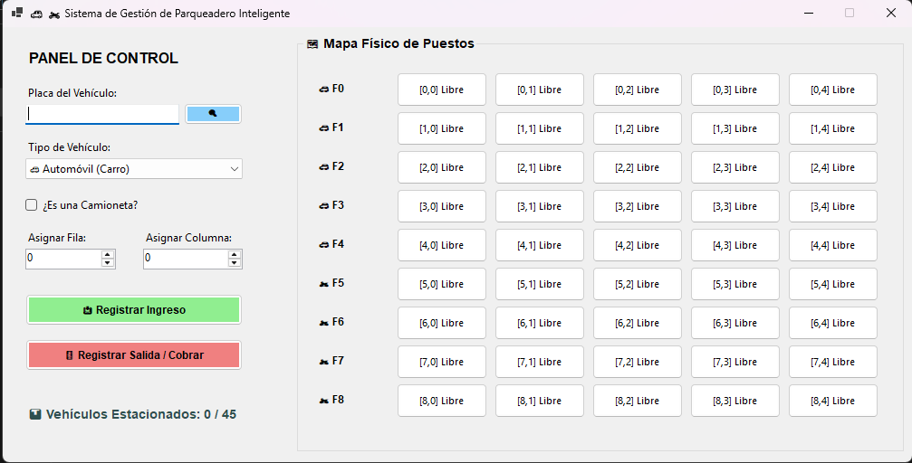

### 🚗 Registro de Carro
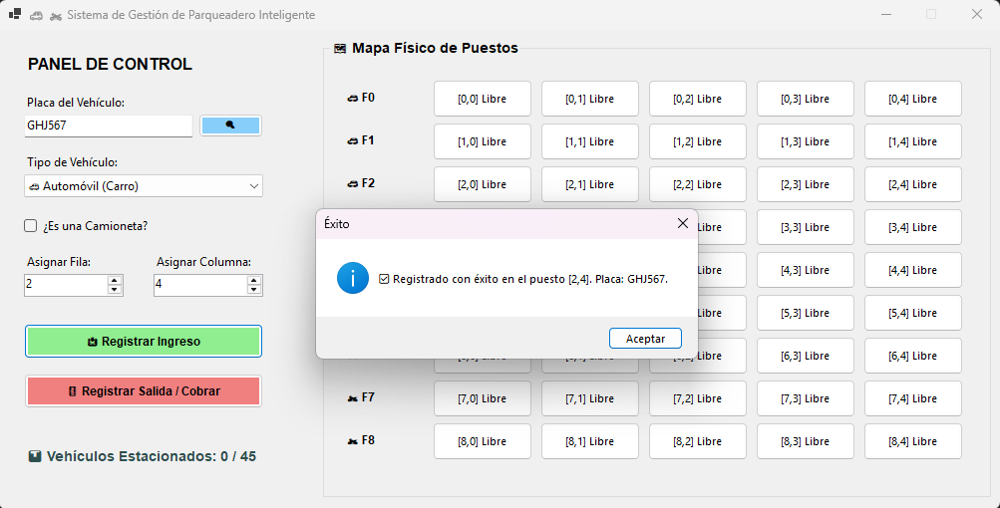

### 🚗 Registro de Camioneta
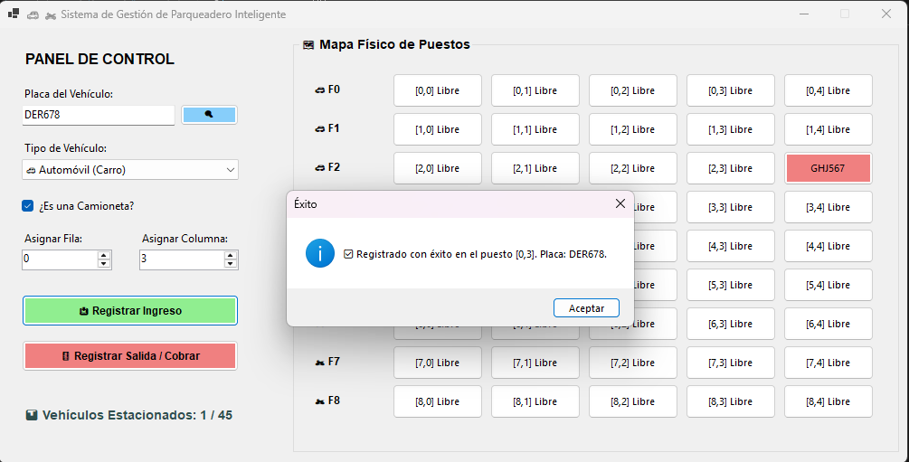

### 🏍️ Registro de Motocicleta
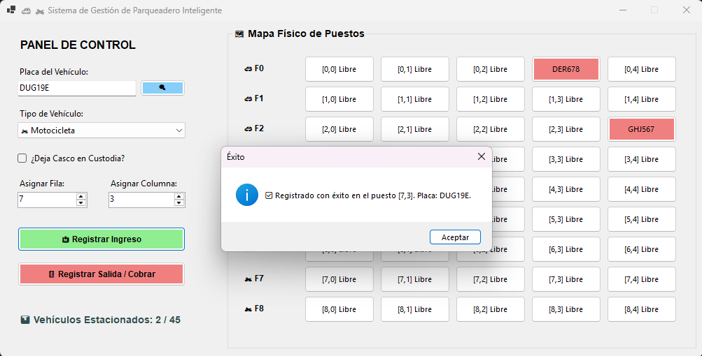

### 🏍️ Registro de Moto con casco
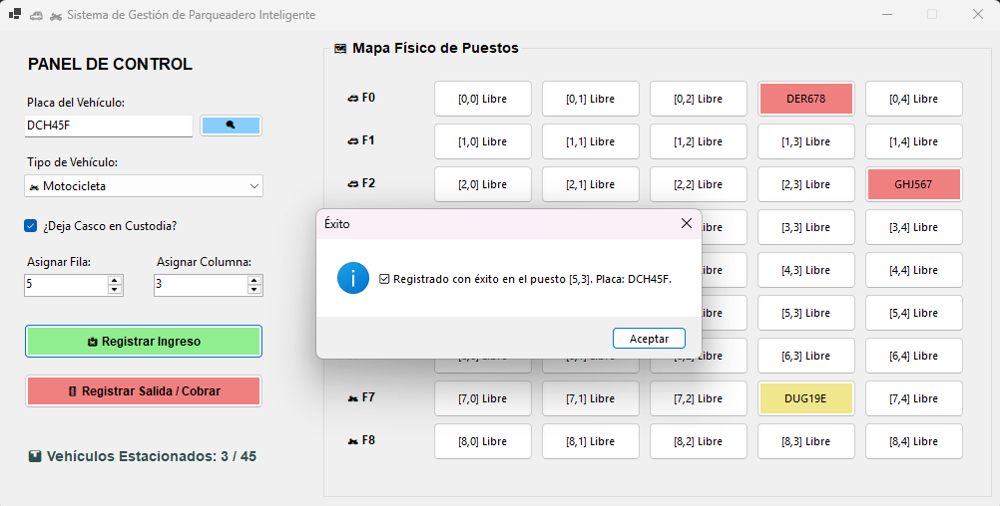

### 🚗 Salida de Carro
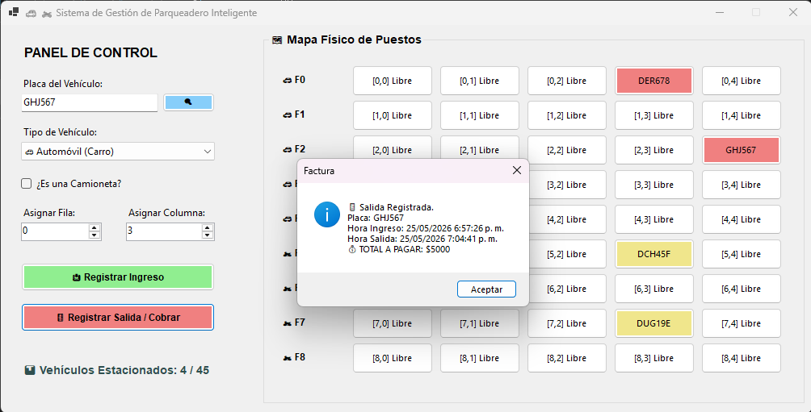

### 🚗 Salida de Camioneta
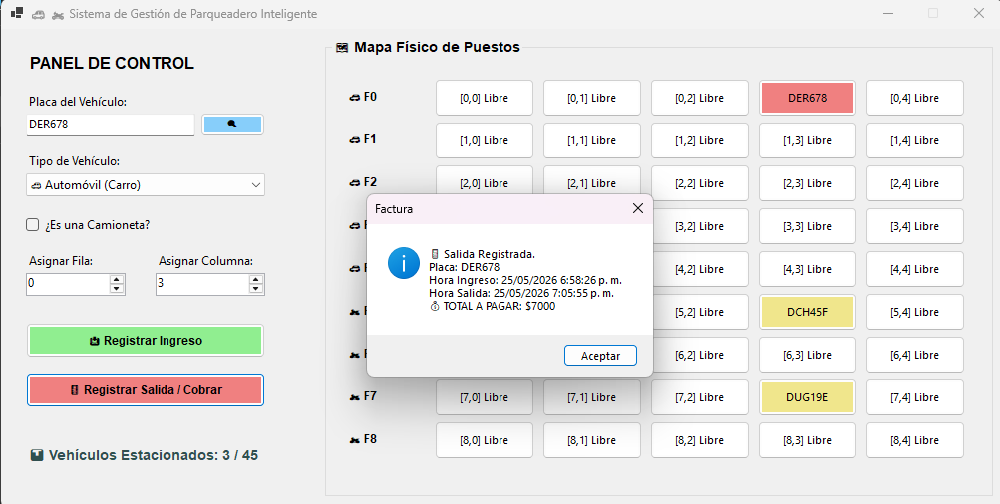

### 🏍️ Salida de Moto
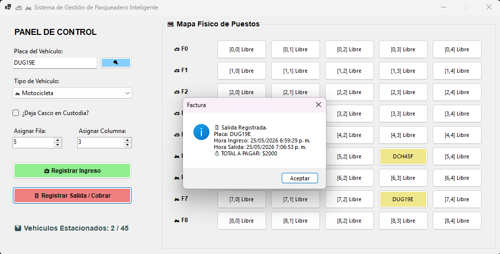

### 🏍️ Salida de Moto con casco
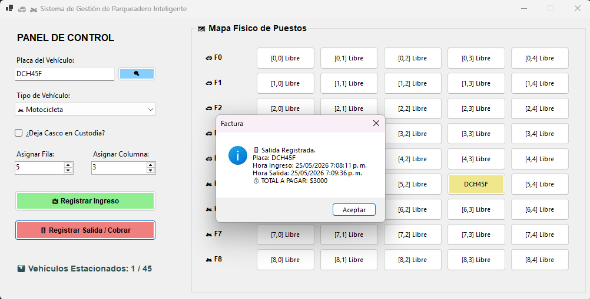

### 🔍 Búsqueda de Vehículo
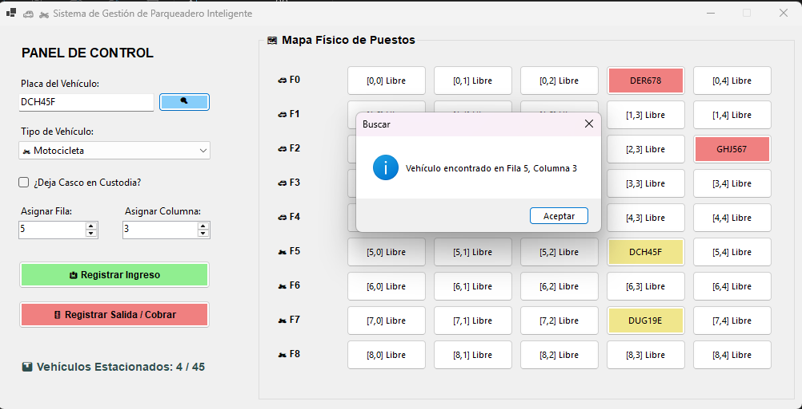

### ❌ Intento en puesto ocupado
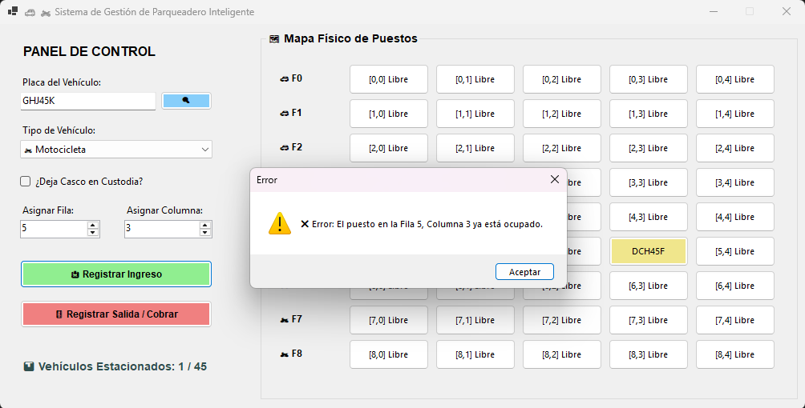

### ❌ Vehículo no encontrado
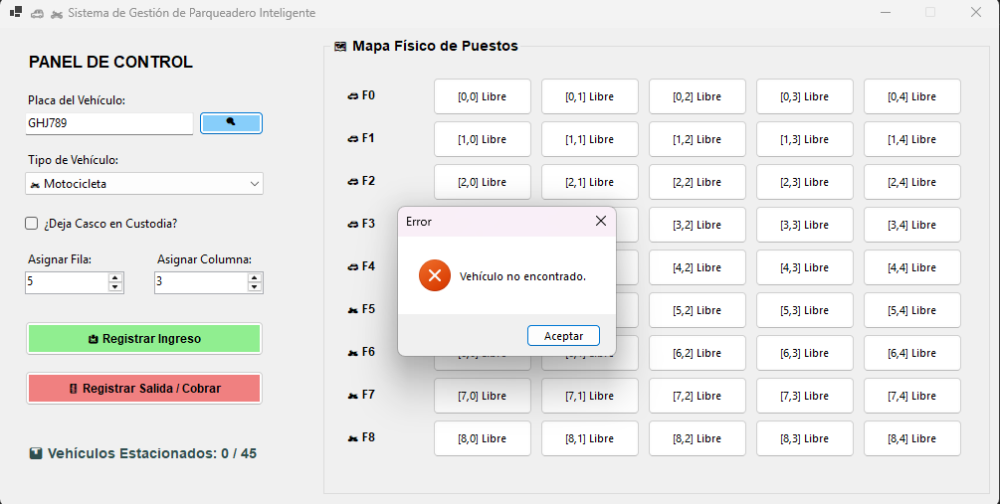

---

## 📘 Diagrama UML

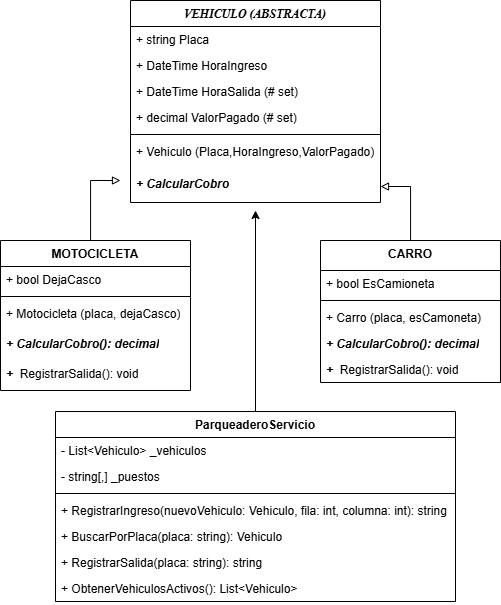


